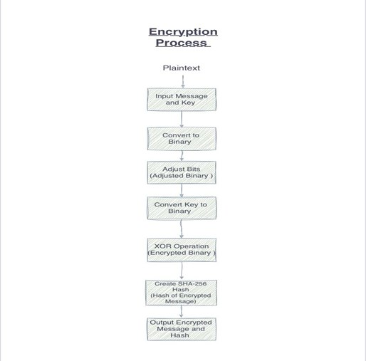
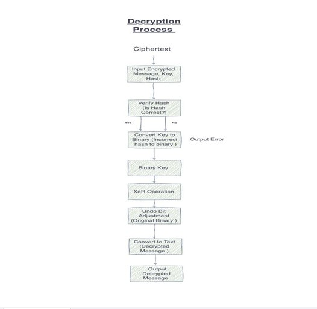
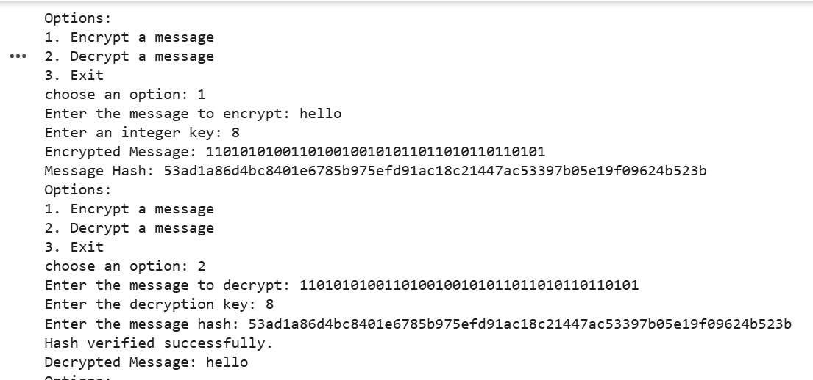

# 🔐 Information Security – Encryption & Decryption Program

---

## 📌 Overview
This project implements an **encryption and decryption system** that secures text messages using a combination of:  

- **Bit manipulation (left & right shifts)**  
- **XOR operation with a key**  
- **SHA-256 hashing for integrity**  

The program provides a simple **menu-driven interface** where the user can:  
1. Encrypt a message.  
2. Decrypt a message (with hash verification).  
3. Exit the program.  

---

## 🎯 Objectives
- Ensure **confidentiality** of data using bitwise encryption.  
- Verify **integrity** of data using SHA-256 hashing.  
- Provide an **interactive CLI application** for easy testing and demonstration.  
- Demonstrate key cryptographic principles (substitution, shifting, XOR, hashing).  

---

## 🛠️ Methodology
1. **Plaintext Input** – The user enters a message.  
2. **Binary Conversion** – Message is converted to binary form.  
3. **Bit Adjustment** – Binary string is shifted left or right depending on the key parity.  
4. **XOR Operation** – Binary message is XORed with a repeated binary key.  
5. **Hashing** – SHA-256 hash of the encrypted binary string is generated for verification.  
6. **Decryption** – Process reversed: verify hash → XOR → undo shift → binary-to-text.  

---

## 🖼️ Diagrams

### 🔒 Encryption Process

### 🔑 Decryption Process

---

## 📸 Sample Output
Example run of the program in the terminal:  

---

  Made with ❤️</b> 

